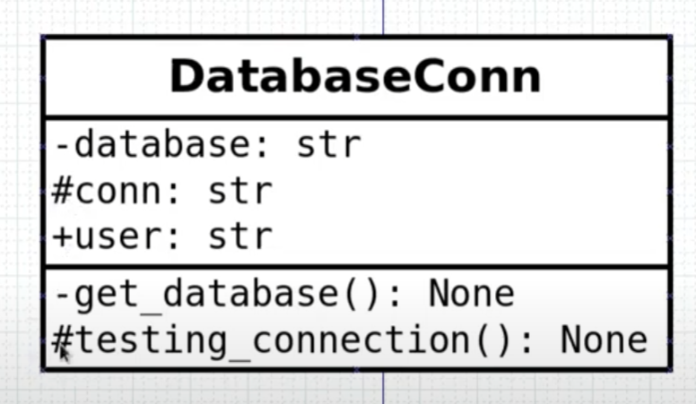
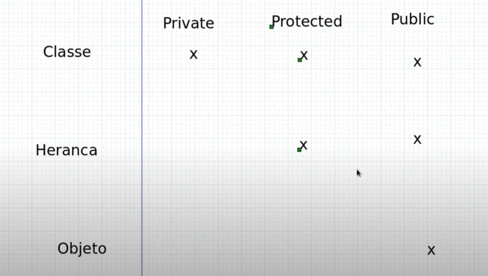

# 13: Encapsulamento em Heranças

- Atributos e métodos com que possuem o encapsulamento protected(protegidos) podem ser herdados pelas classes filhas
- Em python, atributos protegidos são indicados pelo traço `-`, mas são apenas para indicar que deve ser tratado como privado.

## UML






****
## python

```python
class DataBaseConn():

    def __init__(self) -> None:
        self.__database = 'Postgres'
        self._conn = '//connection_string'
        self.user = 'Lhama'

    def get_database(self) -> None:
        print(self.__database)

    def _testing_connection(self) -> None:
        print('Connection Ok!')

class Repository(DataBaseConn):
    
    def __init__(self) -> None:
        super().__init__()

    def select(self) -> None:
        self._testing_connection()
        print('connecting to {}'.format(self._conn))
        print('SELECT * FROM table')
        print(self.user)

repo = Repository()
repo.select()
```