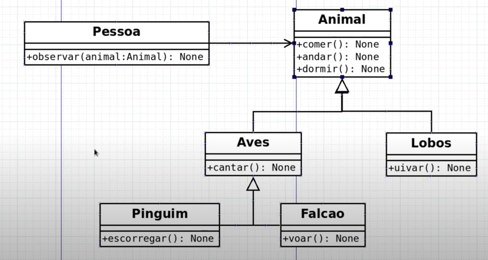
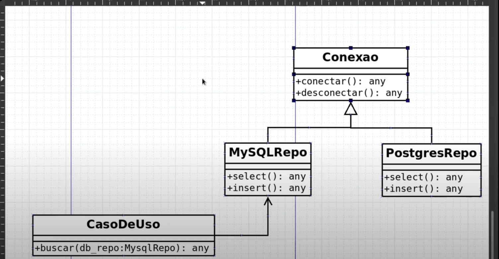

# 14: SOLID(L) - Princípio da Substituição de Liskov

- Classes e Subclasses devem ser "iguais", se uma for substituída pela outra, o código não deve quebrar
  

## UML






## python

```python
from typing import Type

class Animal:

    def comer(self):
        print('O animal está Comendo')

    def dormir(self):
        print('O Animal está Dormindo')

    def andar(self):
        print('O animal está andando na jaula')

class Aves(Animal):

    def __init__(self):
        super().__init__()

    def cantar(self):
        print('A ave está cantando')

class Pinguim(Aves):

    def __init__(self):
        super().__init__()

    def escorregar(self):
        print('O Pinguim está escorregando no gelo')

class Pessoa:

    def observar(self, animal: Type[Animal]):
        animal.comer()

roberto = Pessoa()
pinguim = Pinguim()
roberto.observar(pinguim)
```

```python
from typing import Type

class Conexao:

    def conectar(self):
        print('Conectando ao banco de dados')

    def desconectar(self):
        print('Desconectando ao banco de dados')

class MysqlRepo(Conexao):

    def __init__(self):
        super().__init__()

    def select(self):
        self.conectar()
        print('SELECT * FROM table')


class CasoDeUso:

    def buscar(self, db_repo: Type[MysqlRepo]):
        db_repo.select()
```