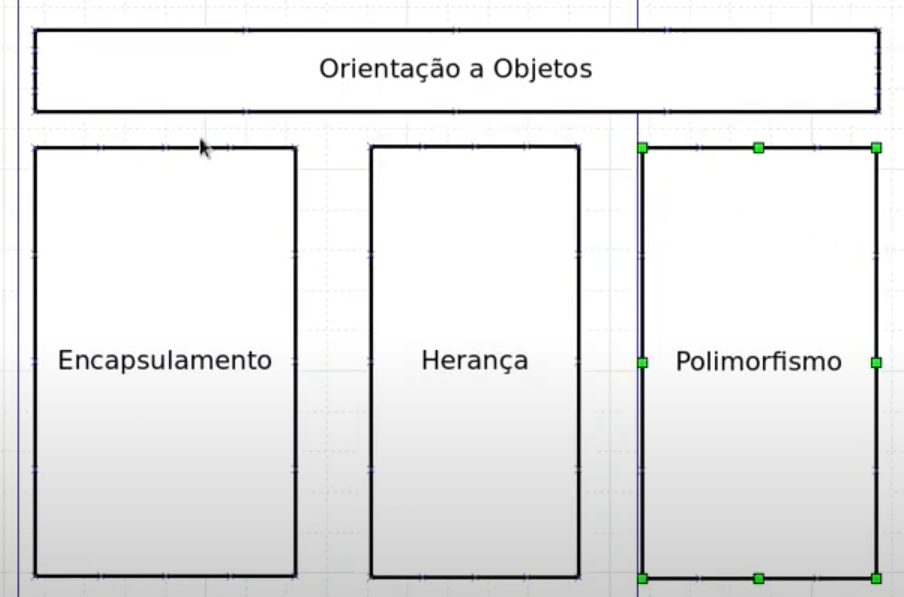
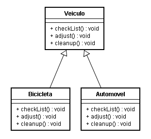

# 15: Polimorfismo

- Polimorfismo é o princípio a partir do qual classes derivadas de uma única classe base são capazes de invocar
- os métodos que, embora apresentem a mesma assinatura, comportam-se de maneira diferente para cada uma das classes derivadas

## UML






## python

```python
from typing import Dict

class Repositorio:

    def select(self, nome: str) -> Dict:
        return { "nome": nome, "idade": 32 }

    def insert(self, nome: str, idade: int) -> Dict:
        print('Inserindo Dados {}, {}'.format(nome, idade))
        return { "nome": nome, "idade": idade }
```

```python
from typing import Dict, Type
from models.repositorio import Repositorio

class Insersor:

    def __init__(self, repositorio: Type[Repositorio]) -> None:
        self.__repo = repositorio

    def inserir_dado(self, nome: str, idade: int) -> Dict:
        registro = self.__repo.select(nome)
        if registro:
            raise Exception('O registro já Existe!')

        novo_registro = self.__repo.insert(nome, idade)
        return novo_registro
```

```python
from models import Insersor, Repositorio, insersor

class RepositorioFaker(Repositorio):
    def __init__(self):
        super().__init__()

    def select(self, name: int) -> None:
        return None

repo = RepositorioFaker()
insersor = Insersor(repo)

data = insersor.inserir_dado('Lhama', 26)
print(data)
```