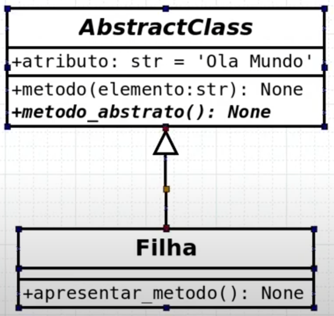

# 16: Métodos e Classes Abstratas

- Classes Abstratas não podem ser instanciadas
- Interessante quando queremos ter uma coleção de elementos e comportamentos e passá-los através de herança
- toda vez que você tiver uma herança, será necessário implementar nas classes filhas esse método abstrato 
- os métodos que, embora apresentem a mesma assinatura, comportam-se de maneira diferente para cada uma das classes derivadas
- Em python, para uma classe ser abstrata, ela deve ter pelo menos 1 método abstrato

## UML



## python

```python
from abc import ABC, abstractmethod

class AbstractClass(ABC):

    def __init__(self):
        self.atributo = 'Olá Mundo'

    def metodo(self, elemento: str) -> None:
        print(elemento)

    @abstractmethod
    def metodo_abstrato(self) -> None:
        pass
```

```python
from abs_class import AbstractClass

class Filha(AbstractClass):

    def apresentar_metodo(self) -> None:
        print(self.atributo)

    def metodo_abstrato(self) -> None:
        print('Implementando método abstrato')

filha = Filha()
filha.apresentar_metodo()
filha.metodo('Estou aqui')
filha.metodo_abstrato()

# Error
# abstractClass = AbstractClass()
# abstractClass.metodo('Fazendo algo')
```