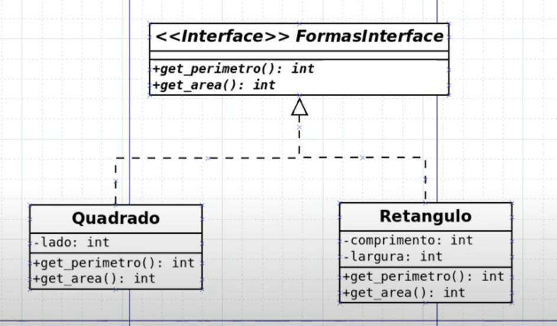
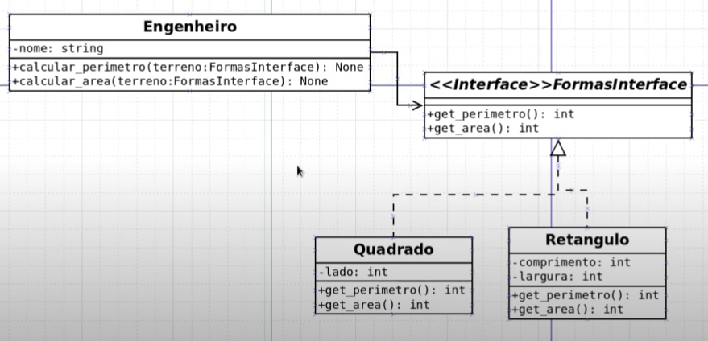

# 17: Interfaces

## UML






## python

```python
from abc import ABC, abstractmethod

class FormasInterface(ABC):

    @abstractmethod
    def get_perimetro(self) -> int:
        pass

    def get_area(self) -> int:
        pass
```

```python
from interfaces.formas import FormasInterface

class TerrenoQuadrado(FormasInterface):

    def __init__(self, lado: int) -> None:
        self.lado = lado

    def get_perimetro(self) -> int:
        perimetro = self.lado * 4
        return perimetro

    def get_area(self) -> int:
        area = self.lado * self.lado
        return area
```

```python
from interfaces.formas import FormasInterface

class TerrenoRetangular(FormasInterface):

    def __init__(self, largura: int, comprimento: int) -> None:
        self.largura = largura
        self.comprimento = comprimento

    def get_perimetro(self) -> int:
        perimetro = (self.comprimento * 2) + (self.largura * 2)
        return perimetro

    def get_area(self) -> int:
        area = self.largura * self.comprimento
        return area
```

```python
from typing import Type
from interfaces.formas import FormasInterface

class Engenheiro:

    def __init__(self, nome: str) -> None:
        self.nome = nome

    def medir_perimetro(self, terreno: Type[FormasInterface]):
        perimetro = terreno.get_perimetro()
        print('{} mediu o perimetro: {} m'.format(self.nome, perimetro))

    def medir_area(self, terreno: Type[FormasInterface]):
        area = terreno.get_area()
        print('{} mediu a área: {} m²'.format(self.nome, area))
```

```python
from terrenos.quadrado import TerrenoQuadrado
from terrenos.retangular import TerrenoRetangular
from engenheiro import Engenheiro

engenheiro = Engenheiro('Geraldo')
terrenoQuadrado = TerrenoQuadrado(4)
terrenoRetangular = TerrenoRetangular(2, 3)

engenheiro.medir_area(terrenoQuadrado)
engenheiro.medir_area(terrenoRetangular)

engenheiro.medir_perimetro(terrenoRetangular)
```