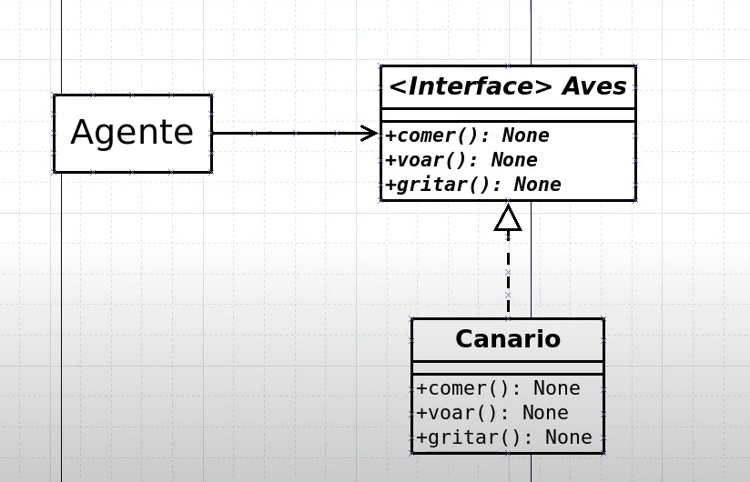

# 18: SOLID(I) - Princípio da Segregação de Interfaces

- Em design de software, deve-se evitar depender que não são utilizadas

## UML



## python

```python
from abc import ABC, abstractmethod

class AveVoadora(ABC):

    @abstractmethod
    def comer(self):
        raise 'Should implement comer method'

    @abstractmethod
    def voar(self):
        raise 'Should implement voar method'

    @abstractmethod
    def gritar(self):
        raise 'Should implement gritar method'


class AveQueNaoVoa(ABC):

    @abstractmethod
    def comer(self):
        raise 'Should implement comer method'

    @abstractmethod
    def gritar(self):
        raise 'Should implement gritar method'

```

```python
from interface import AveVoadora, AveQueNaoVoa

class Canario(AveVoadora):

    def comer(self):
        print('estou comendo!')

    def voar(self):
        print('estou voando!')

    def gritar(self):
        print('estou gritando!')

class Pinguim(AveQueNaoVoa):

    def comer(self):
        print('Estou comendo!')
        self.__acasalar()

    def gritar(self):
        print('Estou gritando!')

    def __acasalar(self):
        print('Agora vou acasalar....')
```

```python
from aves import Canario, Pinguim

canario = Canario()
pinguim = Pinguim()

canario.voar()
pinguim.comer()
```