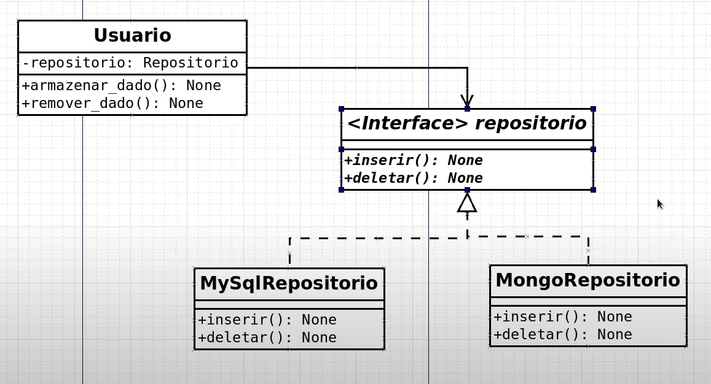

# 19: SOLID(D) - Princípio da Inversão de Dependência

- Desacoplamento de classes de nível superior e inferior

## UML



## python

```python
from abc import ABC, abstractmethod

class Repositorio(ABC):

    @abstractmethod
    def inserir(self, dado) -> None:
        pass

    @abstractmethod
    def deletar(self, dado) -> None:
        pass    
```

```python
from .interface import Repositorio

class MySqlRepositorio(Repositorio):

    def inserir(self, dado) -> None:
        print('Inserindo {} no banco MySql'.format(dado))

    def deletar(self, dado) -> None:
        print('Removendo {} no banco MySql'.format(dado))
```

```python
from .interface import Repositorio

class MongoRepositorio(Repositorio):

    def inserir(self, dado) -> None:
        print('Inserindo {} no banco Mongo'.format(dado))

    def deletar(self, dado) -> None:
        print('Removendo {} no banco Mongo'.format(dado))
```

```python
from typing import Type
from db.interface import Repositorio
from db.mongo_repository import MongoRepositorio
from db.mysql_repository import MySqlRepositorio

class Usuario:

    def __init__(self, repositorio: Type[Repositorio]) -> None:
        self.__repositorio = repositorio

    def armazenar_dado(self, dado: any) -> None:
        self.__repositorio.inserir(dado)

    def remover_dado(self, dado: any) -> None:
        self.__repositorio.deletar(dado)


usuario = Usuario(MySqlRepositorio())
usuario.armazenar_dado(23)

usuario = Usuario(MongoRepositorio())
usuario.armazenar_dado(23)
```