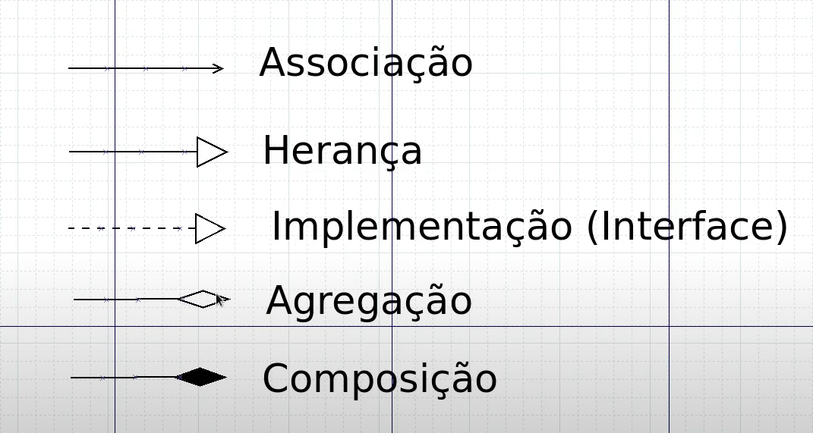
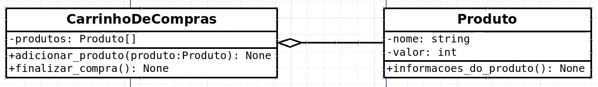
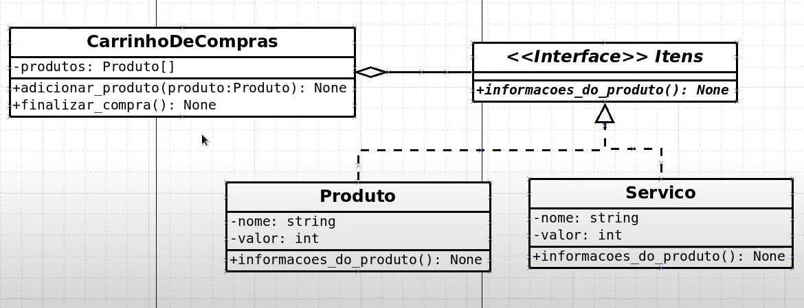

# 20: Agragação de Classes

- Agragação: Agregar em uma certa classe objetos de outra classe

## UML








## python

```python
class Produto:

    def __init__(self, prod_nome: str, prod_valor: int) -> None:
        self.__prod_nome = prod_nome
        self.__prod_valor = prod_valor

    def informacoes_produto(self) -> None:
        print('Produto: {} / valor: R$ {},00'.format(self.__prod_nome, self.__prod_valor))  
```

```python
from produtos import Produto
from typing import Type

class CarrinhoCompras:

    def __init__(self) -> None:
        self.__produtos = []

    def adicionar_produto(self, produto: Type[Produto]) -> None:
        self.__produtos.append(produto)

    def finalizar_compra(self) -> None:
        print('Compras Finalizadas!')

        for produto in self.__produtos:
            produto.informacoes_produto()

        self.__produtos = []
```

```python
from produtos import Produto
from carrinho import CarrinhoCompras

car = CarrinhoCompras()
monitor = Produto('Monitor', 1000)
cerveja = Produto('Cerveja', 5)
tv = Produto('TV', 1200)

car.adicionar_produto(monitor)
car.adicionar_produto(cerveja)
car.adicionar_produto(tv)

car.finalizar_compra()
```