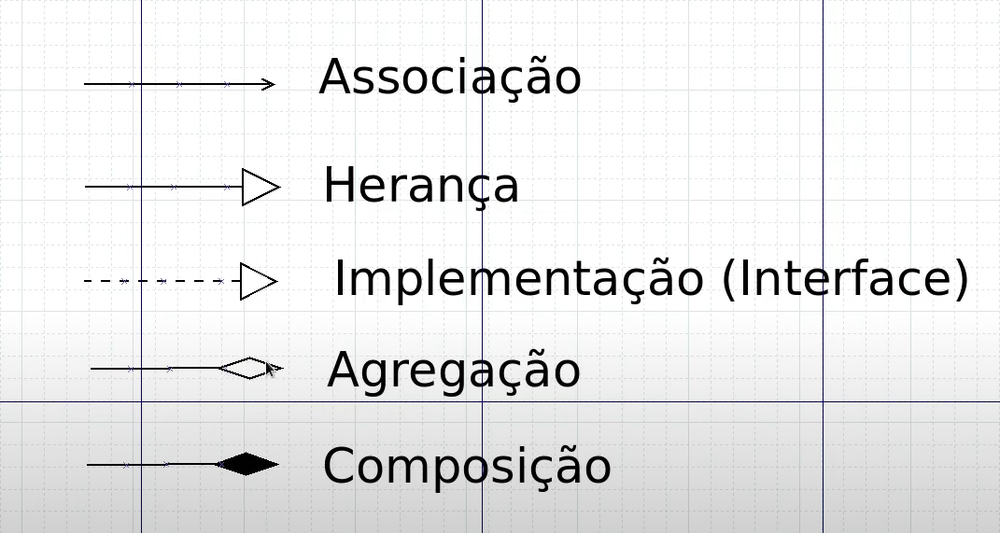
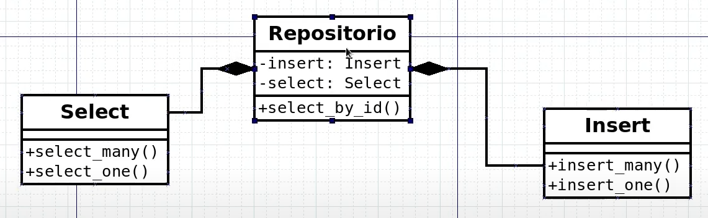

# 21: Composicao de Classes

- Composição: Usada geralmente para fugir da relação de herança
- Outras classes vão compor o comportamento que uma classe vai ter

## UML





## python

```python
class Insert:

    def insert_many(self):
        print('Insert Many')

    def insert_one(self):
        print('Insert One')
```

```python
class Select:

    def select_many(self):
        print('Select Many')

    def select_one(self):
        print('Select One')
```

```python
from sql_actions.insert import Insert
from sql_actions.select import Select

class Repositorio:

    def __init__(self) -> None:
        self.__insert = Insert()
        self.__select = Select()

    def select_by_id(self):
        self.__select.select_one()
```

```python
from repositorio import Repositorio

repo = Repositorio()
repo.select_by_id()
```