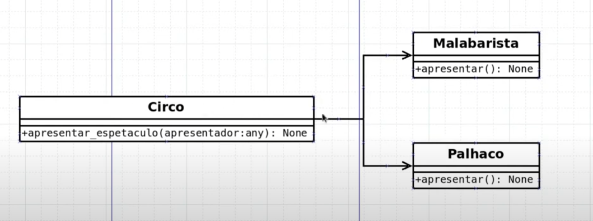
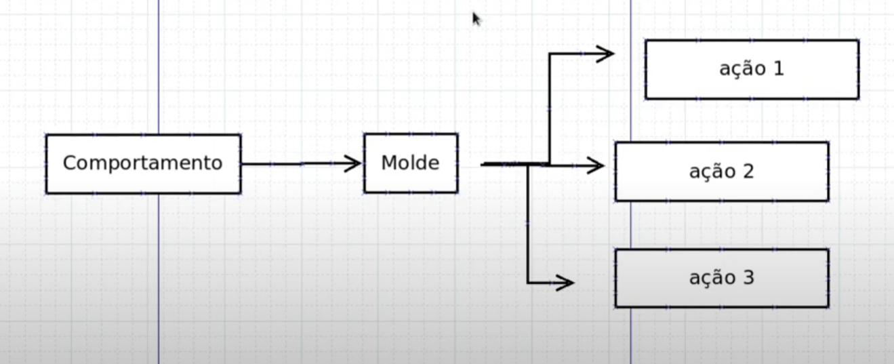

# 7: SOLID(O) - Princípio Aberto/Fechado

- Open/Close Principle(OCP): Sistemas devem ser fáceis de mudar, projetados para permitir que comportamentos sejam alterados pela adição de novo código
- Um módulo é considerado fechado se estiver disponível para outros módulos, ele deve ter uma descrição definida e estável
- Um módulo é considerado aberto se ainda estiver disponível para expansão
- Motivação do OCP: Entradas dieferentes geram ações diferentes

## UML




****
## python

```python
class Circo:

    def apresentar(self, apresentador: any):
        apresentador.apresentar_show()


class Malabarista:

    def apresentar_show(self):
        print('Malabarista apresentando seu show')

class Palhaco:

    def apresentar_show(self):
        print('palhaço apresentando seu show')

class Domador:

    def apresentar_show(self):
        print('Domador apresentando seu show')


circo = Circo()
malabarista = Malabarista()
palhaco = Palhaco()
domador = Domador()

circo.apresentar(malabarista)
circo.apresentar(palhaco)
circo.apresentar(domador)
```