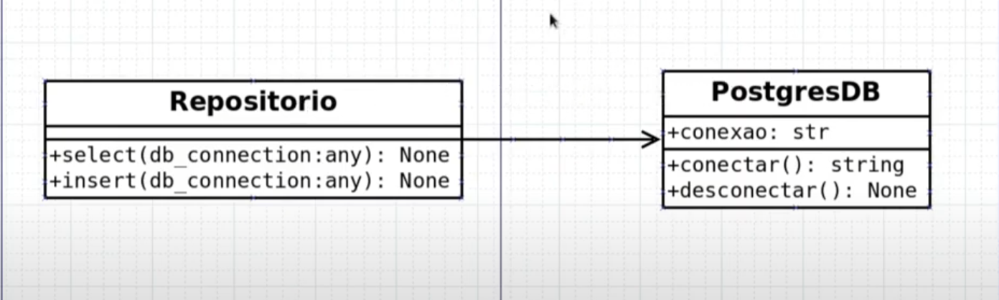

# 9: Exercício Princípio Aberto/Fechado

- A classe repositório atende ao princípio da responsabilidade única(um elemento para select e um pra insert)
- A classe repositório atende ao princípio aberto/fechado ao utilizar o parâmetro db_connection, que faz a conexão com o postgres
- Se quiser usar MYSQL ou SQLLite no lugar de POSTGRES, é só criar uma nova classe de conexão e mmanter o nome dos métodos utilizados na classe repositório

## UML



****
## python

```python
class PostgresDB:

    def __init__(self) -> None:
        self.__conexao = 'Postgres'

    def conectar(self) -> str:
        print('Conectando ao banco Postgres...')
        return self.__conexao

    def desconectar(self) -> str:
        print('Desconectando ao banco Postgres...')
```

```python
class MysqlDB:

    def __init__(self) -> None:
        self.__conexao = 'Mysql'

    def conectar(self) -> str:
        print('Conectando ao banco Mysql...')
        return self.__conexao

    def desconectar(self) -> str:
        print('Desconectando ao banco Mysql...')
```

```python
class Repositorio:

    def select(self, db_connection: any) -> None:
        connection = db_connection.conectar()
        print('conectei ao banco {}'.format(connection))
        print('fazendo um SELECT * FROM...')
        db_connection.desconectar()

    def insert(self, db_connection: any) -> None:
        connection = db_connection.conectar()
        print('conectei ao banco {}'.format(connection))
        print('fazendo um Inser Values...')
        db_connection.desconectar()

```

```python
from repositorio import Repositorio
from databases import PostgresDB, MysqlDB

db_conn_postgres = PostgresDB()
db_conn_mysql = MysqlDB()
repo = Repositorio()

repo.insert(db_conn_postgres)
print()
repo.insert(db_conn_mysql)
```